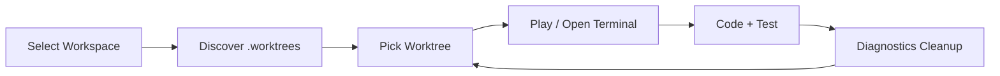
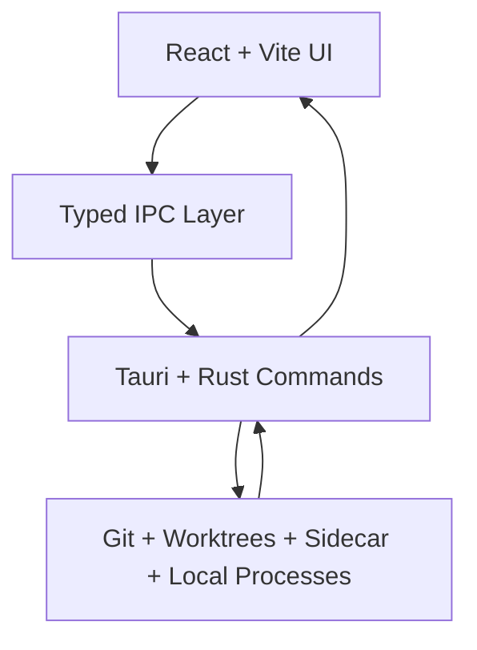

# Groove

> A desktop control center for multi-worktree development.

[](https://github.com/federicoPedraza/groove/actions/workflows/build-desktop.yml)
[](https://github.com/federicoPedraza/groove/actions/workflows/release-desktop.yml)
[](https://github.com/federicoPedraza/groove/actions/workflows/publish-sidecars.yml)

Groove helps you run many Git worktrees without terminal-tab chaos.

Instead of constantly branch-switching one folder, Groove gives you one place to:
- see what’s active,
- launch workflows in the correct worktree,
- open terminals at the right path,
- clean stale local processes,
- keep behavior consistent with workspace settings.

---

## Table of Contents

- [Why Groove](#why-groove)
- [First 60 Seconds](#first-60-seconds)
- [Visual mental model](#visual-mental-model)
- [What Groove does](#what-groove-does)
- [Pages at a glance](#pages-at-a-glance)
- [Architecture](#architecture)
- [Stack](#stack)
- [Repository structure](#repository-structure)
- [Requirements](#requirements)
- [Installation and setup](#installation-and-setup)
- [Sidecars](#sidecars)
- [How to use Groove](#how-to-use-groove)
- [Settings model](#settings-model)
- [Quality checks](#quality-checks)
- [Build and release](#build-and-release)
- [CI](#ci)
- [Troubleshooting](#troubleshooting)
- [Contributing](#contributing)
- [Security and privacy](#security-and-privacy)
- [Roadmap](#roadmap)
- [License](#license)

---

## Why Groove

Multi-worktree development is powerful, but it usually turns into:
- wrong-directory commands,
- hard-to-track runtimes,
- stale processes,
- expensive context switching.

Groove exists to reduce that operational drag.

**Core promise:** keep multi-worktree development organized, visible, and low-friction.

---

## First 60 Seconds

If you just cloned the repo, do this:

```bash
npm install
npm run setup
npm run tauri:dev
```

Then in the app:

1. Select a repository with `.worktrees/`.
2. Open a worktree from Dashboard.
3. Hit **Play** (or open terminal in worktree).
4. Confirm runtime status in Worktrees/Diagnostics.

That’s the fastest path from zero → useful.

---

## Visual mental model

### 1) Workflow loop



### 2) Runtime architecture



---

## What Groove does

### Workspace + worktree management
- Connect a repository directory as active workspace.
- Persist workspace metadata in `.groove/workspace.json`.
- Scan `.worktrees/` and present actionable state.
- Provide worktree actions: restore, play, stop, remove.

### Context-aware execution
- Open terminal directly at selected worktree path.
- Run configurable workspace commands:
  - Play Groove command
  - Open terminal command
  - Run local command
  - Testing ports

### Diagnostics and cleanup
- Inspect OpenCode / Node-related runtime processes.
- Stop individual processes or bulk process groups.
- Emergency kill for non-worktree OpenCode processes.
- System overview + top-consuming programs query.
- `.gitignore` sanity check + optional patch.

### Integrations and task workflows
- Git/GitHub helper command surface.
- Jira connect/sync support.
- Workspace Tasks + Consellour tool loop.

---

## Pages at a glance

| Page | Purpose |
|---|---|
| Dashboard | Main control surface for active workspace + worktree actions |
| Worktrees | Focused view of active/runnable worktrees |
| Diagnostics | Runtime cleanup/control center |
| Tasks | Task + Consellour workflow, Jira sync surface |
| Settings | Workspace commands, integrations, global appearance/toggles |

---

## Architecture

Groove uses a 3-layer model:

1. **UI layer (React + Vite + TypeScript)**
   - Dashboard, Worktrees, Diagnostics, Tasks, Settings
   - Typed frontend IPC from `src/lib/ipc.ts`
2. **Native command layer (Tauri 2 + Rust)**
   - Input/path validation
   - Command orchestration
   - Event emission to frontend
3. **Local runtime layer**
   - Git worktrees
   - Groove sidecar binary
   - Local terminals + process lifecycle

This split keeps the UI fast while preserving local-first control.

---

## Stack

### Frontend
- React 19
- TypeScript 5
- Vite 7
- React Router
- Tailwind CSS 4
- Radix UI primitives + shadcn-style components
- Lucide icons
- Sonner toasts

### Desktop / backend
- Tauri 2
- Rust (`src-tauri`)

### Tooling
- ESLint
- Vitest + Testing Library + jsdom
- TypeScript typecheck (`tsc --noEmit`)
- Cargo check

---

## Repository structure

```text
.
├─ app/                 # Route pages (dashboard/worktrees/diagnostics/settings/tasks)
├─ components/          # Reusable UI + feature components
├─ lib/                 # Frontend helpers
├─ src/                 # App entry + shared frontend modules
├─ src-tauri/           # Tauri + Rust backend
├─ bash/                # Setup/check scripts (Linux/macOS)
├─ powershell/          # Setup/check scripts (Windows)
└─ .github/workflows/   # CI + release workflows
```

---

## Requirements

Install these manually before setup:

- **Node.js 22+** (npm included)
- **Rust toolchain** (`rustc`, `cargo`)

Platform notes:
- Linux builds require Tauri system dependencies (scripts can install best-effort via `apt`).
- macOS setup expects Homebrew availability (script can install/verify).
- Windows setup uses PowerShell and checks WebView2 presence best-effort.

---

## Installation and setup

### Quick local start

```bash
npm install
npm run tauri:dev
```

Frontend-only iteration:

```bash
npm run dev
```

### Unified setup entry point

```bash
npm run setup
```

Checker + minimal repair mode:

```bash
npm run setup -- --mode=checker-repair
# or
npm run setup -- checker-repair
```

### Fast setup (per OS)

```bash
# macOS
./bash/setup-macos-fast
# or
npm run setup:macos

# Linux
./bash/setup-linux-fast
# or
npm run setup:linux

# Windows (PowerShell)
.\powershell\setup-windows-fast.ps1
# or
npm run setup:windows
```

### Guided setup (step-by-step UX)

```bash
# Linux
./setup-linux.sh

# macOS
./setup-macos.sh

# Optional flags
./setup-linux.sh --verbose
./setup-macos.sh --no-color
```

---

## Sidecars

Groove bundles a platform-specific `groove` sidecar via Tauri `externalBin`.

Expected files in `src-tauri/binaries/` include:

- Linux: `groove-x86_64-unknown-linux-gnu` or `groove-aarch64-unknown-linux-gnu`
- macOS: `groove-aarch64-apple-darwin` and `groove-x86_64-apple-darwin`
- Windows: `groove-x86_64-pc-windows-msvc.exe` (arm64 optional)

Validate sidecars:

```bash
npm run sidecar:check:linux
npm run sidecar:check:macos
npm run sidecar:check:windows
```

Runtime resolution checks `GROOVE_BIN` first, then bundled/resource paths.

---

## How to use Groove

Recommended daily loop:

1. Open Groove.
2. Select your repository workspace.
3. Review discovered worktrees.
4. Pick a worktree and run actions (Play / Stop / Terminal / Details).
5. Build/test in that isolated context.
6. Use Diagnostics to clear stale runtime processes.
7. Switch to next worktree cleanly.

Good habits:
- one task per worktree,
- branch-aligned naming,
- prune stale worktrees/processes,
- use context-aware actions instead of manual tab hopping.

---

## Settings model

### Workspace settings (repo-specific)
- `playGrooveCommand`
- testing ports
- open-terminal-at-worktree command
- run-local command
- worktree symlink paths
- Jira/task-related metadata in workspace config

### Global settings (device-wide)
- telemetry toggle
- disable mascot/loading section
- FPS overlay toggle
- always show diagnostics sidebar
- periodic rerender trigger
- theme mode

---

## Quality checks

Run before opening a PR:

```bash
npm run lint
npm run typecheck
npm run test
npm run build
npm run check:rust
```

Useful command list:

```bash
npm run dev
npm run tauri:dev
npm run tauri:build
npm run tauri:build:linux
npm run tauri:build:macos
```

---

## Build and release

Frontend build:

```bash
npm run build
```

Desktop bundles:

```bash
npm run tauri:build
npm run tauri:build:linux
npm run tauri:build:macos
```

Current packaging targets:
- Linux: AppImage + deb
- macOS: dmg

Release workflow publishes bundles on version tags (`v*.*.*`).

---

## CI

GitHub Actions workflows:

- `build-desktop.yml`
  - lint, typecheck, tests, rust check
  - Linux + macOS desktop builds
  - artifact upload
- `release-desktop.yml`
  - tag-triggered release build and publish
- `publish-sidecars.yml`
  - rolling sidecar release (`sidecars-latest`)

Dependabot is configured for npm, cargo, and workflow updates.

---

## Troubleshooting

### Setup fails
- Verify Node.js/npm and Rust are installed.
- Re-run fast setup script for your OS.
- Install missing OS-level Tauri dependencies.

### Sidecar checks fail
- Ensure required files exist in `src-tauri/binaries/`.
- Ensure Unix sidecars are executable.
- Run the matching `npm run sidecar:check:*` command.

### Runtime feels stale/noisy
- Open **Diagnostics**.
- Refresh process snapshots.
- Stop stale OpenCode/Node processes.
- Use clean-all only when needed.

### Wrong-folder command issues
- Use Groove terminal/worktree actions instead of manual terminal hopping.

---

## Contributing

Contributions are welcome.

Suggested flow:

1. Fork and create a branch.
2. Make a focused change.
3. Run quality checks.
4. Open a PR with:
   - what changed,
   - why,
   - validation performed.

If your change affects setup/runtime behavior, include a quick smoke result from `npm run tauri:dev`.

---

## Security and privacy

- Groove is local-first.
- Workspace metadata is local (`.groove/workspace.json`).
- Telemetry is configurable in settings.
- Backend command layer enforces path/payload guardrails.

---

## Roadmap

High-value follow-ups:
- command-by-command invoke reference,
- workspace JSON schema docs,
- OS-specific troubleshooting matrix,
- deeper onboarding/user journeys,
- architecture decision log.

---

## License

A license file is not currently present in this repository.

If you plan to distribute Groove as open source, add a `LICENSE` file (MIT, Apache-2.0, GPL, etc.) and update this section accordingly.
